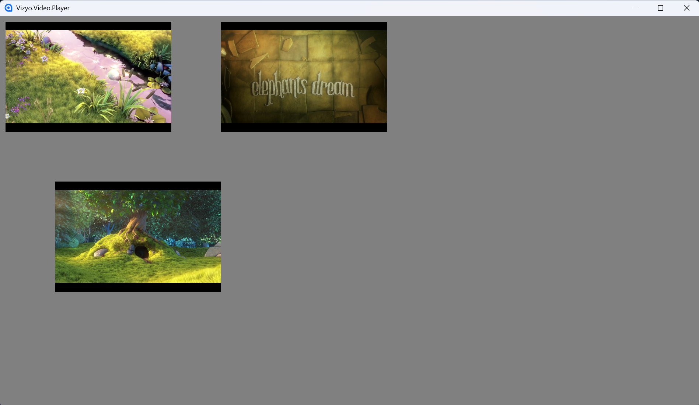
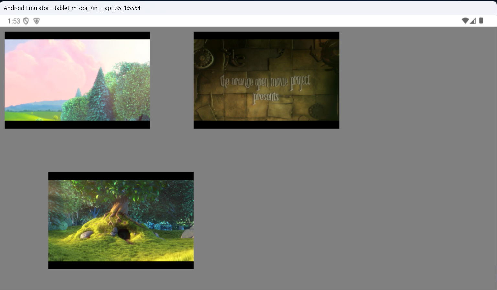

# vizyo-video-player
Video player for Vizyo Digital Signage application.

The goal of this project is to enable multiple video players added as user controls to the main canvas object in a digital signage application to play videos seamlessly.

| Platform | Version   | Status                    |
| :------- | :-------  | :-------------------------------- |
| `windows - pc` | 10, 11| ok |
| `android - tablet` | 7.1.2 API 25| ok | 
| `android tv - mibox` | 9.0 API 28| audio ok, video not | 
| `ubuntu` | | to be tested | 
| `raspberry` | | to be tested | 

Thanks

+ [Avalonia](https://github.com/AvaloniaUI/Avalonia)
+ [Mpv](https://github.com/mpv-player/mpv)
+ [LibMpv.AutoGen](https://github.com/vrjure/LibMPV.AutoGen)

Images

Desktop (Windows, Linux)

Android

